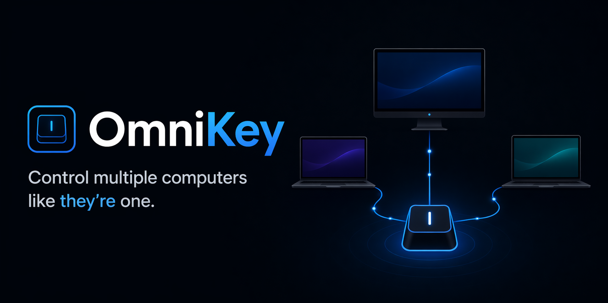

# OmniKey

OmniKey is a fast, secure, and zero-config way to share your keyboard and mouse across multiple computers on the same network.

Built for developers and power users who work across multiple machines.

---

## 🚧 Status
OmniKey is currently in **early development**.
Core functionality is being actively built and is not yet ready for production use.

---

## ✨ Planned Features
- Low-latency input over LAN  
- Automatic device discovery (zero config)  
- Secure device pairing  
- Keyboard and mouse sharing  
- Instant switching via hotkeys  
- Optional edge-based switching  

---

## 🧠 Vision
OmniKey aims to be:
- Fast enough to feel native  
- Simple enough to require no setup  
- Flexible enough to support multiple operating systems  

---

## 🛠️ Roadmap
- [ ] Core networking (LAN)
- [ ] Input capture (keyboard + mouse)
- [ ] Input injection (cross-platform)
- [ ] Device pairing
- [ ] Switching system (hotkeys + edge)
- [ ] Basic UI

---

## ☕ Support
If you find OmniKey interesting, you can support the project:
👉 https://buymeacoffee.com/luismacnunes

---

## 🤝 Contributing
Contributions, ideas, and feedback are welcome.
See [CONTRIBUTING.md](./CONTRIBUTING.md) for more details.
